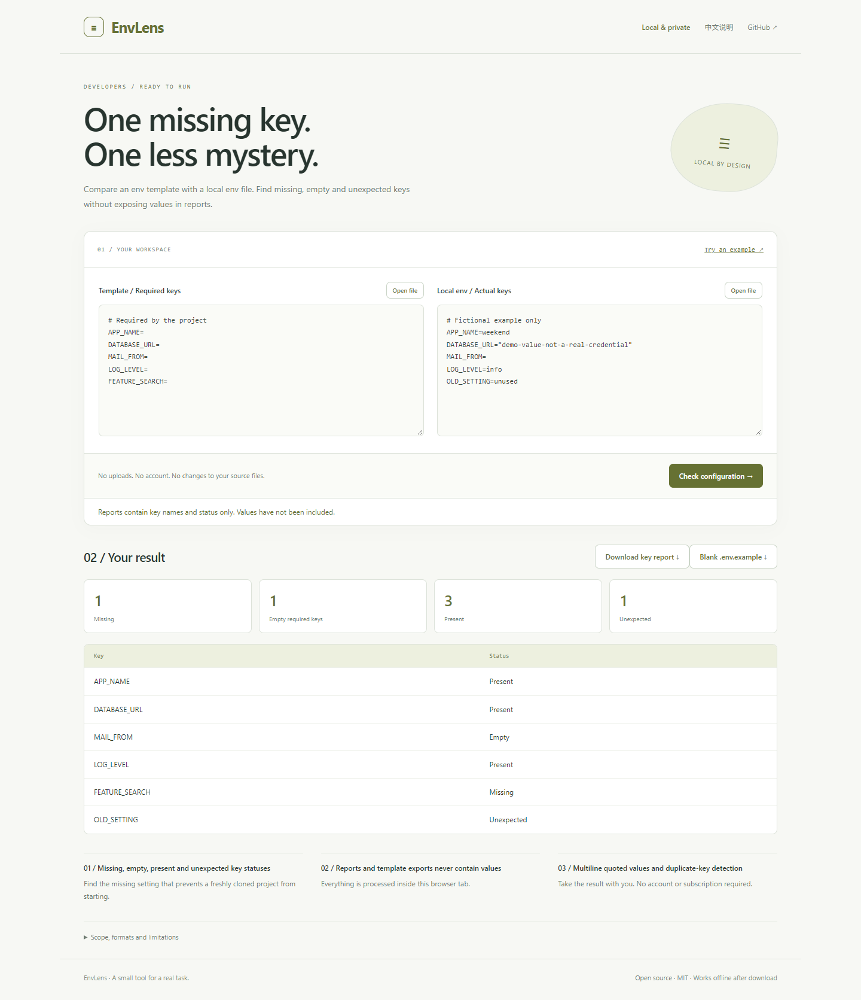

# EnvLens

**One missing key. One less mystery.**

Compare an env template with a local env file. Find missing, empty and unexpected keys without exposing values in reports.

[Open the app](https://sq2100.com/envlens/) · [Download offline HTML](https://github.com/sq2100/envlens/releases/latest) · [简体中文](README.zh-CN.md)



## Why use it?

Find the missing setting that prevents a freshly cloned project from starting.

- Missing, empty, present and unexpected key statuses
- Reports and template exports never contain values
- Multiline quoted values and duplicate-key detection

No uploads, account, API key, tracking scripts, or runtime CDN dependencies. The built app is a single HTML file. Source files are never modified.

## Quick start

Open the [hosted app](https://sq2100.com/envlens/) and click **Try an example**. Or download the HTML from [Releases](https://github.com/sq2100/envlens/releases/latest), then open it in a modern desktop browser.

To build from source (Node.js 20.19+):

```sh
npm ci
npm test
npm run build
```

Open `dist/index.html`, or run `npm start` for a local preview at http://127.0.0.1:4178. Set the `PORT` environment variable to run multiple projects simultaneously.

## Scope and limitations

Checks key presence and empty values; it does not validate credentials or required value formats. Values remain visible in the input fields, so do not screen-share them. Supports KEY=value, optional export, comments, single/double quoted values and multiline quotes. No variable expansion, command execution, backticks or shell evaluation. Duplicates and malformed entries are rejected. UTF-8 imports up to 5 MiB. Reports contain key names, which may still reveal system structure.

The initial version targets modern desktop browsers. Chromium is used for local smoke checks. Browser differences and real-world data may reveal additional edge cases; please report reproducible problems with synthetic examples. No guarantee of suitability for every input is made.

## Privacy

The app processes data in memory and has no application server, analytics, cookies, local storage or external runtime resources. A Content Security Policy blocks network connections and external scripts. User data is rendered as text, except for the intentionally previewed local images and validated colors.

The hosting provider receives normal page-request metadata (such as IP addresses). Download the HTML and open it offline for disconnected work. Exported files may contain your data. Browser extensions, the operating system and a modified hosted copy are outside this app's control.

## Development

Plain JavaScript, browser APIs, Node’s built-in test runner, and esbuild. Core logic lives in `src/core.js`; UI behavior is in `src/app.js`. Run `npm run format` before sending changes. GitHub Actions tests and builds each push; the separate Pages workflow publishes the demo when run manually.

[Contributing](CONTRIBUTING.md) · [Security](SECURITY.md) · [MIT license](LICENSE)
